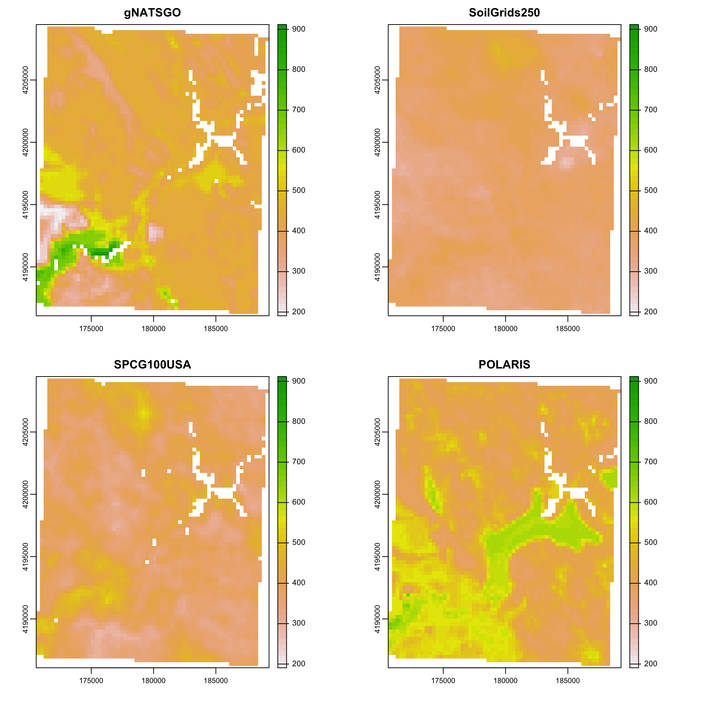
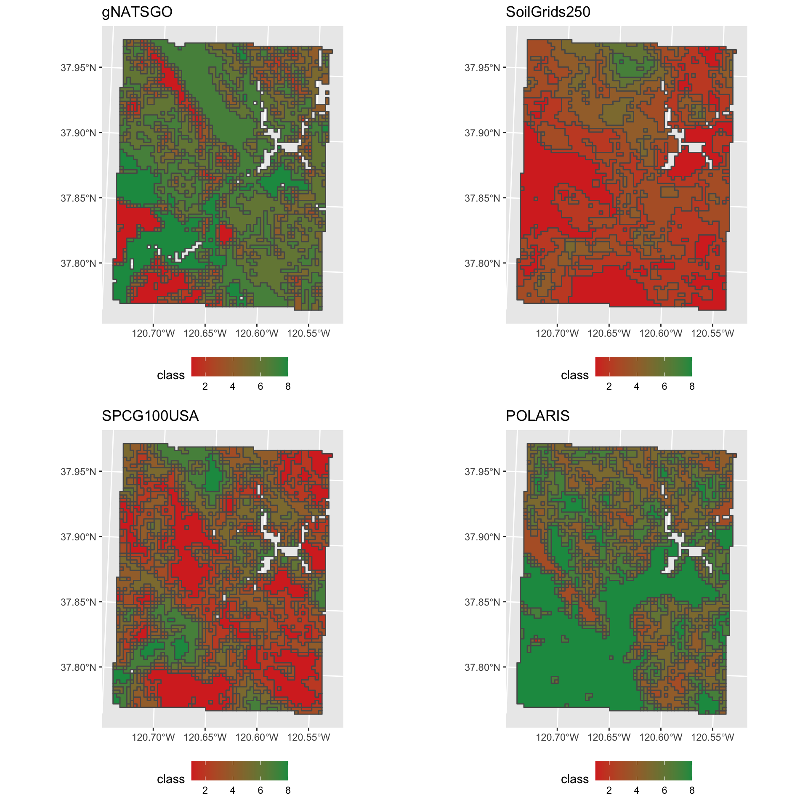

This repository contains a set of R Markdown scripts that allow you to evaluate of maps of soil properties made by Predictive Soil Mapping (PSM) over the continental USA (CONUS, "the lower 48"). The procedures explained here allow comparison between digital products, and can reveal to what extent predictions made by predictive match predictions made with the best available local knowledge, especially detailed field survey.

These scripts were used to prepare the following paper:

Rossiter, David G., Poggio, L., Beaudette, D., & Libohova, Z. (2021). _How well does Predictive Soil Mapping represent soil geography? An investigation from the USA_. **SOIL Discussions**, in preparation, 35 pp..


# Background

The USA has a long-established soil survey, and most of the lower 48 States (CONUS) have been mapped in detail with extensive field investigation. Thus digital products directly based on these surveys (e.g., gSSURGO, gNATSGO) are presumed to be as accurate as possible, or at least can serve as a reference for comparison.

There are several PSM products that are based on these surveys but with some PSM applied (e.g., POLARIS), and others that are only based on point datasets, environmental covariates that are supposed to represent soil-forming factors, and models. These include global (e.g., SoilGrids v2.0 from ISRIC) and USA-specific (e.g., Soil Properties and Class 100m Grids USA) models. The latter can use CONUS-only covariates such as surficial geology and parent material derived from the original soil survey, as well as global covariates but limited to their relation with CONUS points.

# Products

There are several sources of soil property information for the USA:

* [gNATSGO](https://www.nrcs.usda.gov/wps/portal/nrcs/detail/soils/survey/geo/?cid=nrcseprd1464625), entire CONUS;
* [gSSURGO](https://www.nrcs.usda.gov/wps/portal/nrcs/detail/soils/survey/geo/?cid=nrcs142p2_053628), by State;
* [Global Soil Map v0.5](https://www.nrcs.usda.gov/wps/portal/nrcs/detail/soils/research/?cid=nrcseprd1321715);
* [Intermediate-scale gridded soil property and interpretation maps from averaged and aggregated SSURGO and STATSGO data](https://github.com/ncss-tech/ISSR-800), abbreviated as ISSR-800; this has largely been superseded by gNATSGO;
* POLARIS Soil Properties;
* [SoiLGrids250](https://www.isric.org/explore/soilgrids)  from ISRIC;
* [Soil Properties and Class 100m Grids USA](https://doi.org/10.18113/S1KW2H), abbreviated as _SPCG100_;
* [LandGIS](https://opengeohub.org/about-landgis) from the private company [EnvirometriX](http://envirometrix.nl/).

SG2, POLARIS and LandGIS also give uncertainty estimates as the 5/95% quantiles. gNATSGO/gSSURGO give low and high estimated values, as well as representative value.

## Coverage and mapping method

Here is a brief explanation of each of these:

* _gNATSGO_ is complete coverage of the best available soils information for all areas of the United States and Island Territories. It was created by combining data from the Soil Survey Geographic Database (SSURGO), State Soil Geographic Database (STATSGO2), and Raster Soil Survey Databases (RSS) offsite link image into a single seamless ESRI file geodatabase",  [here](https://nrcs.app.box.com/v/soils). Resolution is 30~m. Also available via Web Coverage Services (WCS).
<p>
The map units often have multiple components and properties must be extracted by weighted aggregation from the relational database.

* _gSSURGO_ is a set of statewide polygon maps with the associated SSURGO relational database that can be rasterized. ESRI file geodatabases; also available as 10~m rasterized coverages, [here](https://nrcs.app.box.com/v/soils). 
<p>
The map units often have multiple components and properties must be extracted by weighted aggregation from the relational database.

* _Global Soil Map v0.5_ is the USA's contribution to the GlobalSoilMap.net project, Gbased on Soil Survey Geographic Database (SSURGO), at nominal 100 m grid resolution.
<p>
Partially explained in Hempel, J., Libohova, Z., Odgers, N., Thompson, J., Smith, C. A., & Lelyk, G. (2012). Versioning of GlobalSoilMap.net raster property maps for the North American Node. In Digital Soil Assessments and Beyond: Proceedings of the Fifth Global Workshop on Digital Soil Mapping 2012, Sydney, Australia (pp. 429–433). CRC Press. https://doi.org/10.13140/2.1.4670.2404.
<p>
A promised 1.0+ is supposed to use a DSM approach from NCSS-KSSL point observations, i.e., a conventional DSM approach.

* _ISSR-800_ "Intermediate-scale gridded soil property and interpretation maps from averaged and aggregated SSURGO and STATSGO data" at 800 m resolution. 

* _POLARIS_ is the result of harmonizing diverse SSURGO and STATSGO polygon data with the DSMART algorithm to produce a raster soil series map (30 m resolution) and then extracting property information from Official Series Descriptions.
<p>
It is explained in: Chaney, N. W., Minasny, B., Herman, J. D., Nauman, T. W., Brungard, C. W., Morgan, C. L. S., McBratney, A. B., Wood, E. F., & Yimam, Y. (2019). POLARIS soil properties: 30-m probabilistic maps of soil properties over the contiguous United States. Water Resources Research, 55(4), 2916–2938. Scopus. https://doi.org/10.1029/2018WR022797 


* _SoilGrids_ is a system for global digital soil mapping that makes use of global soil profile information and covariate data to model the spatial distribution of soil properties across the globe. SoilGrids250 is a collections of soil property maps at six standard depths at 250 m grid resolution.
<p>
SoilGrids250 filenames, procedures etc. are explained in a [FAQ](https://www.isric.org/explore/soilgrids/faq-soilgrids).
<p>
The choice of the [Goode Homolosine projection](https://en.wikipedia.org/wiki/Goode_homolosine_projection) is explained in Moreira de Sousa, L., L. Poggio, and B. Kempen. 2019. Comparison of FOSS4G Supported Equal-Area Projections Using Discrete Distortion Indicatrices. ISPRS International Journal of Geo-Information 8(8): 351. https://doi.org/10.3390/ijgi8080351.
 

* _SPCG100_ is an adaption of the SoilGrids methodology for the USA, using  the NCSS Characterization Database, the National Soil Information System (NASIS), and the Rapid Carbon Assessment (RaCA) point datasets and some covariates only available for the USA, giving a 100 m grid resolution.
<p>
Explained in Ramcharan, A., T. Hengl, T. Nauman, C. Brungard, S. Waltman, et al. 2018. Soil property and class maps of the conterminous United States at 100-meter spatial resolution. Soil Science Society of America Journal 82(1): 186–201. https://doi.org/10.2136/sssaj2017.04.0122. This source was able to use 87 parent material classes  four and drainage classes based on the representative soil components of gSSURGO map units.

* _LandGIS_ follows the approach of SoilGrids V1 (ISRIC), with more points, additional covariates, and ensemble machine-learning methods.

## Depth slices

* _gNATSGO_, _gSSURGO_ gives values by genetic horizon, with no standard intervals, however they are served as WCS with any depth interval, by depth-weighted averaging over the requested depth slice.
* _GSMv05_, _SoilGrids250_ and _POLARIS_ predict as average values over the GlobalSoilMap.net specification depth slices: 0-5, 5-15, 15-30, 30-60, 60-100, and 100-200 cm. In fact SoilGrids250 (and POLARIS?) predict at the midpoint of these intervals but report the values as if they cover the interval.
* _SPCG100US_ makes predictions for 7 standard soil depths (0, 5, 15, 30, 60, 100 and 200 cm). These are considered "point" predictions, i.e., the values for an infintesimal vertical extent at these depth points.
* _ISSR-800_ can be produced for any depth slice, as a thickness-weighted average based on gSSURGO.
* _LandGIS_ makes point predictions at 6 standard soil depths (0, 10 (not 5 or 15), 30, 60, 100 and 200 cm).

# Procedures

These are detailed in [this HTML document](./ComparePSMproductsUSA.html), also available as [this PDF document](./ComparePSMproductsUSA.pdf).

# Example figures

```{r, echo=FALSE, out.width="50%", fig.align="center", fig.cap="Sand concentration %%, 5-15~cm; UTM 17N"}

```

```{r, echo=FALSE, out.width="50%", fig.align="center", fig.cap="Sand concentration %%, 5-15~cm, class maps by histogram equalization"}

```


